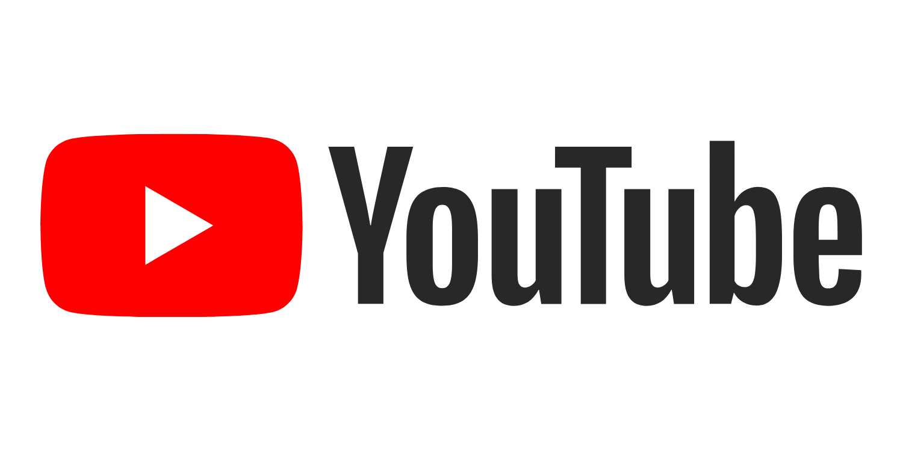

# YouTubeEngagementPrediction

YouTube is undoubtedly one of the most influential forms of media today. It has replaced traditional TV and radio for the simple fact that it's accessible to everyone. Anyone with a camera or animation skills has the potential to make content and anybody with an internet connection can watch. In October of 2006, Google purchased YouTube for $1.6 billion in what has become one of the best business decisions they've ever made. 

A few years ago, YouTube added a trending tab which features popular new content. It has helped channels grow from small to large by being put in the spotlight for everyone to see and enjoy. This repository analyzes a dataset of trending videos and predicts forms of engagment such as likes, views, comments using random forest regression and extra trees regression. Some other useful information was determined such as:

  1. What are the most frequent categories in trending?
  2. Which categories recieve the highest likes to dislikes ratio?
  3. What are the most frequent tags?
  4. How does engagement change over time? Are there months where likes, comments, views are the highest?
